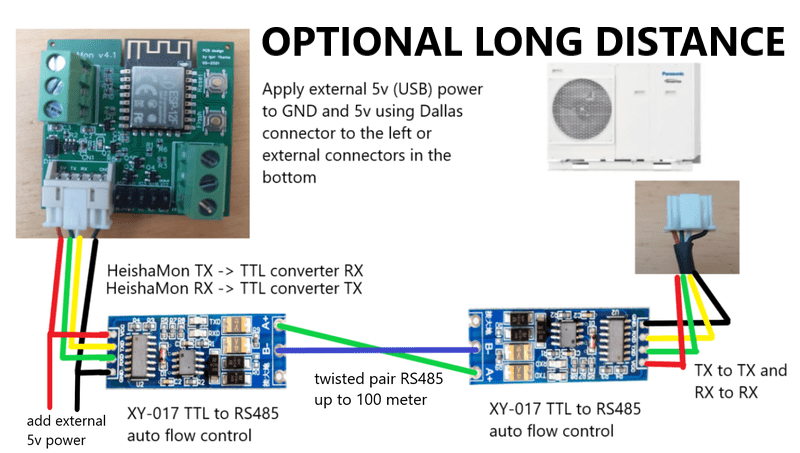

[](https://join.slack.com/t/panasonic-wemos/shared_invite/enQtODg2MDY0NjE1OTI3LTgzYjkwMzIwNTAwZTMyYzgwNDQ1Y2QxYjkwODg3NjMyN2MyM2ViMDM3Yjc3OGE3MGRiY2FkYzI4MzZiZDVkNGE)
[](https://github.com/the78mole/HeishaMon/actions/workflows/main.yml)


# Panasonic H, J, K & L Series Aquarea Luft-Wasser-Wärmepumpen Protokoll

Dieses Projekt ermöglicht es, Informationen von der Panasonic Aquarea Wärmepumpe auszulesen und die Daten entweder an einen MQTT-Server zu senden oder als JSON-Format über HTTP bereitzustellen.

Die englische Originaldokumentation findest du unter [README.md](README.md). \
Een nederlandse vertaling [README_NL.md](README_NL.md) vind je hier. \
Suomen kielellä [README_FI.md](README_FI.md) luettavissa täällä.

*Hilfe bei der Übersetzung in weitere Sprachen ist willkommen.*

# Aktuelle Versionen
Die aktuelle Version findest du [hier](https://github.com/Egyras/HeishaMon/releases). Das für ESP8266 kompilierte Binary kann auf einem Wemos D1 mini, auf dem HeishaMon-PCB und grundsätzlich auf jedem ESP8266-basierten Board installiert werden, das mit den Wemos-Build-Einstellungen kompatibel ist (mindestens 4 MB Flash). Du kannst den Code auch selbst herunterladen und kompilieren (siehe erforderliche Bibliotheken unten). Das ESP32-S3-Binary ist für die neuere, große Version des Heishamon.


# Nutzung der Software
HeishaMon ist in der Lage, mit der Panasonic Aquarea H, J, K und L-Serie zu kommunizieren. [Vom Benutzer bestätigte Wärmepumpentypen findest du hier](HeatPumpType.md) \
Wenn du das Image selbst kompilieren möchtest, stelle sicher, dass du die genannten Bibliotheken und die Unterstützung für ein Dateisystem auf dem ESP8266 verwendest. Wähle dazu die korrekte Flash-Option in der Arduino IDE.

Beim ersten Start ohne konfiguriertes WLAN wird ein offener WLAN-Hotspot sichtbar, der es dir ermöglicht, dein WLAN-Netzwerk und deinen MQTT-Server zu konfigurieren. Die Konfigurationsseite ist unter http://192.168.4.1 erreichbar. \

Nach der Konfiguration und dem Neustart kann das Image die Wärmepumpe auslesen und mit ihr kommunizieren. Die GPIO13/GPIO15-Verbindung wird für die Kommunikation genutzt, sodass du deinen Computer/Uploader weiterhin angeschlossen lassen kannst. \
Serial 1 (GPIO2) kann für eine weitere serielle Verbindung (nur GND und TX vom Board) verwendet werden, um Debug-Daten auszulesen.

Alle empfangenen Daten werden an verschiedene MQTT-Topics gesendet (siehe unten für Topic-Beschreibungen). Es gibt auch ein MQTT-Topic 'panasonic_heat_pump/log', das Debug-Logging und einen Hexdump der empfangenen Pakete bereitstellt (wenn im Webportal aktiviert).

Du kannst ein 1-Wire-Netzwerk an GPIO4 anschließen, das in separaten MQTT-Topics (panasonic_heat_pump/1wire/sensorid) berichtet.

Die Software ist außerdem in der Lage, Watt an einem S0-Port von zwei kWh-Zählern zu messen. Du musst nur GPIO12 und GND an den S0-Anschluss eines kWh-Zählers verbinden. Wenn du einen zweiten kWh-Zähler benötigst, verwende GPIO14 und GND. Die Werte werden über das MQTT-Topic panasonic_heat_pump/s0/Watt/1 und panasonic_heat_pump/s0/Watt/2 sowie in der JSON-Ausgabe gemeldet. Du kannst 'Watt' im vorherigen Topic durch 'Watthour' ersetzen, um den Verbrauchszähler in Wattstunden (pro MQTT-Nachricht) zu erhalten, oder durch 'WatthourTotal', um den Gesamtverbrauch in Wattstunden zu erhalten. Um den WatthourTotal mit deinem kWh-Zähler zu synchronisieren, veröffentliche den korrekten Wert per MQTT an das Topic panasonic_heat_pump/s0/WatthourTotal/1 oder panasonic_heat_pump/s0/WatthourTotal/2 mit der 'retain'-Option, während Heishamon neu startet.

Das Firmware-Update ist so einfach wie das Aufrufen des Firmware-Menüs und nach der Authentifizierung mit dem Benutzernamen 'admin' und dem Passwort 'heisha' (oder einem anderen beim Setup angegebenen Passwort) das Hochladen der Binary.

Eine JSON-Ausgabe aller empfangenen Daten (Wärmepumpe und 1-Wire) ist unter der URL http://heishamon.local/json verfügbar (ersetze heishamon.local durch die IP-Adresse deines Heishamon-Geräts, wenn MDNS nicht funktioniert).

Im Ordner 'integrations' findest du Beispiele, wie du deine Automatisierungsplattform mit dem HeishaMon verbinden kannst.

# Regeln-Funktionalität
Die Regeln-Funktionalität ermöglicht es dir, die Wärmepumpe direkt vom HeishaMon aus zu steuern. Das macht es viel zuverlässiger als die Steuerung über externe Hausautomatisierung über WLAN. Wenn ein neues Regelwerk veröffentlicht wird, wird es sofort validiert und bei Gültigkeit übernommen. Wenn ein neues Regelwerk ungültig ist, wird es ignoriert und das alte Regelwerk wieder geladen. Du kannst die Konsole auf Rückmeldungen überprüfen. Falls ein neues gültiges Regelwerk den HeishaMon zum Absturz bringt, wird es beim nächsten Neustart automatisch deaktiviert, sodass du Änderungen vornehmen kannst. Dies verhindert eine Boot-Schleife des HeishaMon.

Die im Regelwerk verwendeten Techniken ermöglichen die Arbeit mit sehr großen Regelwerken, aber Best Practice ist es, sie unter 10.000 Bytes zu halten.

Beachte, dass das Senden von Befehlen an die Wärmepumpe asynchron erfolgt. Befehle, die zu Beginn deiner Syntax an die Wärmepumpe gesendet werden, spiegeln sich nicht sofort in den Werten der Wärmepumpe wider. Daher sollten Wärmepumpen-Werte direkt von der Wärmepumpe gelesen werden, nicht aus selbst gespeicherten Werten.

## Syntax
Zwei allgemeine Regeln: Leerzeichen sind obligatorisch und Semikolons werden als Zeilenende-Zeichen verwendet.

### Variablen
Das Regelwerk verwendet die folgende Variablenstruktur:

- `#`: Globale Variablen
Diese Variablen sind im gesamten Regelwerk zugänglich, müssen aber innerhalb eines Regelblocks definiert werden. Verwende keine globalen Variablen für alle deine Variablen, da sie dauerhaft Speicher belegen.

- `$`: Lokale Variablen
Diese Variablen leben innerhalb eines Regelblocks. Wenn ein Regelblock endet, werden diese Variablen bereinigt und der verwendete Speicher freigegeben.

- `@`: Wärmepumpen-Parameter
Diese sind dieselben wie in der Dokumentationsseite "Manage Topics" und auf der HeishaMon-Startseite aufgeführt. Das Regelwerk folgt auch der R/W-Logik, die über MQTT und REST API verwendet wird. Das bedeutet, dass sich die Lese-Topics von den Schreib-Topics unterscheiden. So erfolgt das Lesen des Wärmepumpenstatus über `@Heatpump_State`, das Ändern des Status über `@SetHeatpump`.

- `%`: Datums- und Zeit-Variablen
Diese können für datum- und zeitbasierte Regeln verwendet werden. Derzeit werden `%hour` (0-23), `%minute` (0-59), `%month` (1-12) und `day` (1-7) unterstützt. Alle sind einfache Integer. Eine ordnungsgemäße NTP-Konfiguration ist erforderlich, um das korrekte Systemdatum und die Systemzeit auf dem HeishaMon zu setzen.

- `?`: Thermostat-Parameter
Diese Variablen spiegeln Parameter wider, die vom angeschlossenen Thermostat gelesen werden, wenn die OpenTherm-Funktionalität verwendet wird. Die Namen sind für Lesen und Schreiben identisch, aber nicht alle Werte unterstützen Lesen und/oder Schreiben. Der OpenTherm-Tab listet dies auch auf.

- `ds18b20#2800000000000000`: Dallas 1-Wire Temperaturwerte
Verwende diese Variablen, um die Temperatur der angeschlossenen Sensoren zu lesen. Diese Werte sind natürlich schreibgeschützt. Die ID des Sensors sollte nach dem Hashtag stehen.

- `s0#watt[hour[total]]_?`: Die S0-Werte für Port 1 und 2. Ersetze das Fragezeichen durch die Portnummer.
Zum Beispiel s0#watt_1 für Watt von Port 1 und s0#watthourtotal_2 für gesamte Wattstunden von Port 2.


Wenn eine Variable aufgerufen wird, aber noch keinen Wert hat, ist der Wert `NULL`.

Variablen können vom Typ Boolean (`1` oder `0`), Float (`3.14`), Integer (`10`) und String sein. Strings werden mit einfachen oder doppelten Anführungszeichen definiert.

### Ereignisse oder Funktionen
Regeln werden in `event`- oder `function`-Blöcken geschrieben. Diese Blöcke werden ausgelöst, wenn etwas passiert: entweder ein neuer Wärmepumpen- oder Thermostatwert empfangen wurde oder ein Timer ausgelöst wurde. Oder sie können als einfache Funktionen verwendet werden.

```
on [event] then
  [...]
end

on [name] then
  [...]
end
```

Ereignisse können Wärmepumpen- oder Thermostat-Parameter oder Timer sein:
```
on @Heatpump_State then
  [...]
end

on ?setpoint then
  [...]
end

on timer=1 then
  [...]
end
```

Wenn du Funktionen definierst, benennst du deinen Block einfach und kannst ihn von überall aus aufrufen:
```
on foobar then
  [...]
end

on @Heatpump_State then
  foobar();
end
```

Funktionen können Parameter haben:
```
on foobar($a, $b, $c) then
  [...]

on @Heatpump_State then
  foobar(1, 2, 3);
end
```

Wenn du eine Funktion mit weniger Werten aufrufst, als die Funktion erwartet, haben alle anderen Parameter den Wert NULL.

Es gibt eine spezielle Funktion, die beim Systemstart oder beim Speichern eines neuen Regelwerks aufgerufen wird:
```
on System#Boot then
  [...]
end
```

Diese spezielle Funktion kann verwendet werden, um deine globalen Variablen oder bestimmte Timer initial zu setzen.

### Operatoren
Reguläre Operatoren werden mit ihrer Standard-Assoziativität und -Präzedenz unterstützt. Dies ermöglicht auch die Verwendung regulärer Mathematik.
- `&&`: Und
- `||`: Oder
- `==`: Gleich
- `>=`: Größer oder gleich
- `>`: Größer als
- `<`: Kleiner als
- `<=`: Kleiner oder gleich
- `-`: Minus
- `%`: Modulo
- `*`: Multiplizieren
- `/`: Dividieren
- `+`: Plus
- `^`: Potenz

Klammern können verwendet werden, um Operatoren zu priorisieren, wie es in der regulären Mathematik der Fall wäre.

### Funktionen
- `coalesce`
Gibt den ersten Wert zurück, der nicht `NULL` ist. Z.B. `$b = NULL; $a = coalesce($b, 1);` gibt 1 zurück. Diese Funktion akzeptiert eine unbegrenzte Anzahl von Argumenten.

- `max`
Gibt den maximalen Wert der Eingabeparameter zurück.

- `min`
Gibt den minimalen Wert der Eingabeparameter zurück.

- `isset`
Gibt den booleschen Wert true zurück, wenn die Eingabevariable noch `NULL` ist. In allen anderen Fällen gibt sie false zurück.

- `round`
Rundet den Eingabe-Float auf die nächste ganze Zahl.

- `floor`
Der größte ganzzahlige Wert, der kleiner oder gleich dem Eingabe-Float ist.

- `ceil`
Der kleinste ganzzahlige Wert, der größer oder gleich dem Eingabe-Float ist.

- `setTimer`
Setzt einen Timer, der in X Sekunden ausgelöst wird. Der erste Parameter ist die Timer-Nummer und der zweite Parameter die Anzahl der Sekunden bis zur Auslösung. Ein Timer wird nur einmal ausgelöst und muss für wiederkehrende Ereignisse neu gesetzt werden.

- `print`
Gibt einen Wert auf der Konsole aus.

- `concat`
Verbindet verschiedene Werte zu einem kombinierten String. Z.B.: `@SetCurves = concat('{zone1:{heat:{target:{high:', @Z1_Heat_Curve_Target_High_Temp, ',low:32}}}}');`

- `gpio`
Ermöglicht das Setzen oder Auslesen eines GPIO-Zustands. Wenn mit einem einzelnen Argument aufgerufen, wird der GPIO-Zustand zurückgegeben. Wenn mit zwei Argumenten aufgerufen, wird der Zustand eines GPIO gesetzt. Diese Funktion setzt nur digitale Pins, sodass der Zustand nur 0 oder 1 sein kann. Die beiden Relais auf dem großen Heishamon sind gpio21 und gpio47. Die benutzerkonfigurierbaren Extra-GPIOs (siehe unten) können ebenfalls über ihre Pin-Nummer angesprochen werden. Siehe das Beispiel zum Umschalten der Relais alle zwei Sekunden.

```
on System#Boot then
   setTimer(10, 2);
end

on timer=10 then
   setTimer(20, 2);
   gpio(21,0);
   gpio(47,1);
end

on timer=20 then
   setTimer(10, 2);
   gpio(21,1);
   gpio(47,0);
end
```

### Bedingungen
Die einzigen unterstützten Bedingungen sind `if`, `else` und `elseif`:

```
if [Bedingung] then
  [...]
else
  if [Bedingung] then
    [...]
  end
end
```

```
if [Bedingung] then
  [...]
elseif [Bedingung] then
  if [Bedingung] then
    [...]
  else
    [...]
  end
elseif [Bedingung] then
  [...]
else
  [...]
end
```

### Beispiele

*WAR-Berechnung (Wettergeführte Regelung)*
```
on calcWar($Ta1, $Tb1, $Ta2, $Tb2) then
	#maxTa = $Ta1;

	if @Outside_Temp >= $Tb1 then
		#maxTa = $Ta1;
	elseif @Outside_Temp <= $Tb2 then
		#maxTa = $Ta2;
	else
		#maxTa = $Ta1 + (($Tb1 - @Outside_Temp) * ($Ta2 - $Ta1) / ($Tb1 - $Tb2));
	end
end
```

*Thermostat-Sollwert*
```
on ?roomTemp then
	calcWar(32, 14, 41, -4);

	$margin = 0.25;

	if ?roomTemp > (?roomTempSet + $margin) then
		if @Heatpump_State == 1 then
			@SetHeatpump = 0;
		end
	elseif ?roomTemp < (?roomTempSet - $margin) then
		if @Heatpump_State == 0 then
			@SetHeatpump = 1;
		end
	else
		@SetZ1HeatRequestTemperature = round(#maxTa);
	end
end
```

# Werksreset
Ein Werksreset kann über die Web-Oberfläche durchgeführt werden. Wenn die Web-Oberfläche nicht verfügbar ist, kann ein Doppel-Reset durchgeführt werden. Der Doppel-Reset sollte nicht zu schnell, aber auch nicht zu langsam ausgeführt werden. Normalerweise reicht eine halbe Sekunde zwischen den beiden Resets. Um anzuzeigen, dass der Doppel-Reset einen Werksreset durchgeführt hat, blinkt die blaue LED schnell (Du musst jetzt erneut Reset drücken, um den HeishaMon normal neu zu starten, wo ein WLAN-Hotspot sichtbar sein sollte).

# Weitere Informationen
Unten findest du einige technische Details zum Projekt. Wie du deine eigenen Kabel bauen kannst. Wie du deine eigene Platine bauen kannst usw.

## Verbindungsdetails:
Die Kommunikation kann über einen der beiden Anschlüsse hergestellt werden: CN-CNT oder CN-NMODE. Wenn du eine vorhandene Panasonic CZ-TAW1 WiFi-Schnittstelle hast, die du durch HeishaMon ersetzen möchtest, musst du nur das Kabel aus dem CZ-TAW1 herausziehen und mit deinem HeishaMon-Gerät verbinden. Es ist jedoch nicht möglich, HeishaMon und das originale CZ-TAW1-Modul gleichzeitig als aktive Geräte zu verwenden. Es ist jedoch möglich, HeishaMon in den "Nur-Zuhören"-Modus zu versetzen, der die Koexistenz von HeishaMon und dem originalen CZ-TAW1-Modul ermöglicht. Der einzige Nachteil ist, dass HeishaMon keine Befehle senden und die optionale PCB-Option verwenden kann.

Kommunikationsparameter: TTL 5V UART 9600,8,E,1  \
 \
CN-CNT Pin-Belegung (von oben nach unten) \
1 - +5V (250mA)  \
2 - 0-5V TX (von der Wärmepumpe) \
3 - 0-5V RX (zur Wärmepumpe)\
4 - +12V (250mA) \
5 - GND \
 \
CN-NMODE Pin-Belegung (von links nach rechts) \
"Achtung! Wie auf der Platine aufgedruckt, ist der linke Pin Pin 4 und der rechte Pin ist Pin 1. Zähle nicht 1 bis 4 von links!  \
4 - +5V (250mA)  \
3 - 0-5V TX (von der Wärmepumpe) \
2 - 0-5V RX (zur Wärmepumpe) \
1 - GND

HeishaMon wird über das Kabel von Panasonic mit Strom versorgt (5V).

## Verbindung über große Entfernung
Es ist möglich, den HeishaMon über eine große Entfernung anzuschließen. Bis zu 5 Meter funktionieren mit normalem Kabel. Für größere Entfernungen ist eine TTL-zu-RS485-Konfiguration wie im Bild unten möglich. Dies erfordert jedoch eine externe 5V-Stromversorgung des HeishaMon (z.B. über ein USB-Kabel).




## Wo du Steckverbinder bekommst
[RS-Online Bestellungen](Connectors_RSO.md)

[Conrad Bestellungen](Connectors_Conrad.md)

Verwende ein abgeschirmtes 24 AWG 4-adriges Kabel.


## Die HeishaMon-Hardware selbst
Die zur Verbindung mit der Wärmepumpe benötigten PCBs wurden von Projektmitgliedern entworfen und sind unten aufgeführt. Der wichtigste Teil der Hardware ist eine Pegelumwandlung von 5V von Panasonic auf 3,3V des HeishaMon und eine GPIO13/GPIO15-Aktivierungsleitung nach dem Booten. \
[PCB-Designs der Projektmitglieder](PCB_Designs.md) \
[Bild Wemos D1 Beta](WEMOSD1.JPG) \
[Bild ESP12-F](NewHeishamon.JPG)

Um es einfach zu machen, kannst du eine fertige Platine von einigen Projektmitgliedern bestellen: \
[Lectronz shop](https://lectronz.com/products/heishamon-communication-pcb) von Igor Ybema (aka TheHogNL) aus den Niederlanden

## Arduino-Image selbst bauen
Boards: \
esp8266 by esp8266 community version 3.0.2 [Arduino](https://github.com/esp8266/Arduino/releases/tag/3.0.2)

Alle [von uns verwendeten Bibliotheken](LIBSUSED.md) die zum Kompilieren notwendig sind.


## MQTT-Topics
[Aktuelle Liste der dokumentierten MQTT-Topics findest du hier](MQTT-Topics.md)

## Kommunikationszuverlässigkeit
Nachrichten von HeishaMon an die Wärmepumpe werden gelegentlich verworfen, besonders wenn mehrere Einstellungen in kurzer Zeit geändert werden. Es ist nicht möglich für HeishaMon, alle verworfenen Nachrichten zu wiederholen, daher sollten Benutzer ihre eigene Wiederholungslogik implementieren.

Die empfohlene Wiederholungslogik ist folgende:
1. Nachdem du eine Wärmepumpen-Einstellung über HeishaMon geändert hast, warte darauf, dass HeishaMon meldet, dass die Einstellung geändert wurde.
2. Wenn die Einstellung nach 10 Sekunden nicht aktualisiert wurde, setze sie erneut.

Dies kann im HeishaMon selbst mit Regeln implementiert werden, wie in diesem Beispiel:
```
on StopExternalControl then
  if @External_Control != 0 then
    @SetExternalControl = 0;
    settimer(9,10);
  end
end

on timer=9 then
  if @External_Control != 0 then
    @SetExternalControl = 0;
  end
end
```

## EEPROM-Warnung
Bis heute wissen wir nicht, wie die an die Wärmepumpe gesendeten Befehle in der Wärmepumpe selbst verarbeitet werden. Höchstwahrscheinlich werden viele Befehle in EEPROM gespeichert, um nach einem Stromausfall verfügbar zu sein, wie z.B. das Einstellen der Warmwassertemperatur. Ein EEPROM kann viele Schreibvorgänge verarbeiten, aber es gibt eine Grenze. Und wir kennen die Grenze auch nicht. Stelle also sicher, dass du die Wärmepumpe nicht mit zu vielen Befehlen überlastest. Jede Sekunde ist viel zu häufig. Ein paar pro Stunde und Einstellung sollte wahrscheinlich in Ordnung sein. Außerdem ist eine Wärmepumpe ein langsames Heiz-(Kühl-)Gerät, sodass so häufige Änderungen wahrscheinlich ohnehin keinen Sinn machen.

## DS18b20 1-Wire-Unterstützung
Die Software unterstützt auch das Auslesen von DS18B20 1-Wire-Temperatursensoren. Eine korrekte 1-Wire-Konfiguration (mit 4,7kOhm Pull-up-Widerstand) an GPIO4 wird alle konfigurierten Sekunden (mindestens 5) gelesen und an das Topic panasonic_heat_pump/1wire/"sensor-hex-adresse" gesendet. Auf den vorgefertigten Boards ist dieser 4,7kOhm-Widerstand bereits installiert.

## Relaissteuerung auf der großen Platine
Der neuere, große, Heishamon enthält zwei eingebaute Relais, die über MQTT-Befehle ein- und ausgeschaltet werden können. Die Relais können für jede Kontaktschaltung verwendet werden, auch 230V Netzspannung (max. 5A). Um das Relais zu steuern, sende einfach einen Wert von 1 oder 0 an das MQTT-Topic "panasonic_heat_pump/gpio/relay/one" für Relais eins oder "panasonic_heat_pump/gpio/relay/two" für Relais zwei.

## Benutzerkonfigurierbare Extra-GPIOs
Zusätzlich zu den festen Relais-Pins stellt HeishaMon eine Anzahl benutzerkonfigurierbarer GPIO-Pins bereit, die jeweils unabhängig über das Einstellungs-Webmenü auf Eingang (Pull-up), Eingang oder Ausgang gesetzt werden können.

**Verfügbare Pins je Plattform:**
- **ESP8266:** 3 Extra-GPIOs (Pins 1, 3, 16)
- **ESP32:** 5 Extra-GPIOs (Pins 33–37); Relais-Pins 21 und 47 bleiben fest

Der Modus für jeden Pin wird in den Einstellungen gespeichert und beim Booten sowie beim Speichern von Einstellungen angewendet.

**Steuerung von Ausgangs-GPIOs über MQTT:**
Sende `1`, `0`, `on`, `off`, `true` oder `false` an:
```
panasonic_heat_pump/gpio/extra/N
```
wobei `N` der 1-basierte Index des Extra-GPIO ist (z.B. `extra/1` für den ersten Extra-Pin).

**GPIO-Zustände über MQTT lesen:**
Eingangs- und Ausgangszustände werden automatisch bei Änderungen und beim ersten MQTT-Connect (retained) an dieselben Topics veröffentlicht.

**HTTP API:**
Alle Extra-GPIO-Zustände können als JSON über eine GET-Anfrage gelesen werden:
```
GET /gpio
```
Beispielantwort:
```json
[{"pin":33,"mode":2,"state":1},{"pin":34,"mode":0,"state":0}, ...]
```
wobei `mode` 0 = Eingang (Pull-up), 1 = Eingang, 2 = Ausgang bedeutet.

Einen Ausgangspin per HTTP POST setzen:
```
POST /gpio?pin=N&value=1
```

**Extra-GPIOs in Regeln verwenden:**
Die `gpio()`-Regelfunktion funktioniert mit den Extra-GPIO-Pins über ihre physische Pin-Nummer, genauso wie die Relais-Pins.

## OpenTherm-Unterstützung
Wenn deine Heishamon-Platine OpenTherm unterstützt, kann die Software auch verwendet werden, um OpenTherm-Informationen von einem kompatiblen Thermostat über MQTT oder JSON an deine Hausautomatisierung zu übertragen. Wenn du die OpenTherm-Unterstützung in den Einstellungen aktivierst, erscheint ein neuer Tab auf der Webseite mit OpenTherm-Werten. Einige sind vom Typ R(ead) und einige vom Typ W(rite), manche sind beides. Read bedeutet, dass der Thermostat diese Information vom Heishamon lesen kann. Du stellst diese Information über MQTT (oder per Regeln) bereit, indem du diesen Wert im MQTT-Topic 'opentherm/read' aktualisierst. Die Write-Werte sind Informationen vom Thermostat, wie 'roomTemp'. Diese sind im MQTT-Topic 'opentherm/write' verfügbar.

Die verfügbaren OpenTherm-Variablen sind:
### WRITE-Werte
- chEnable: Boolean, ob Zentralheizung aktiviert werden soll
- dhwEnable: Boolean, ob Warmwasserheizung aktiviert werden soll
- coolingEnable: Boolean, ob Kühlung aktiviert werden soll
- roomTemp: Float-Wert der gemessenen Raumtemperatur durch den Thermostat
- roomTempSet: Float-Wert des angeforderten Raumtemperatur-Sollwerts am Thermostat
- chSetpoint: Float-Wert des berechneten Wasser-Sollwerts durch den Thermostat
- maxRelativeModulation: Modulationsmenge (0-100%), die die Wärmepumpe verwenden darf
- coolingControl: Kühlmenge (0-100%), die der Thermostat von der Wärmepumpe anfordert
### READ AND WRITE-Werte
- dhwSetpoint: Float-Wert des aktuellen DHW-Sollwerts
- maxTSet: Float-Wert, der den maximalen Wasser-Sollwert definiert
### READ-Werte
- chPressure: Float-Wert des gemessenen Wasserdrucks
- outsideTemp: Float-Wert der gemessenen Außentemperatur
- inletTemp: Float-Wert der gemessenen Wassereintrittstemperatur
- outletTemp: Float-Wert der gemessenen Wasseraustrittstemperatur
- dhwTemp: Float-Wert der gemessenen Warmwassertemperatur
- relativeModulation: Aktuelle Modulationsmenge (0-100%)
- flameState: Boolean, ob die Zentralheizung Wärme liefert
- chState: Boolean, ob die Wärmepumpe im Raum-/Zentralheizungsmodus ist
- dhwState: Boolean, ob die Wärmepumpe im Warmwassermodus ist
- coolingState: Boolean, ob die Wärmepumpe im Kühlmodus ist
- dhwSetUppBound: Integer (0-127), maximale DHW-Temperatur. Standard: 75
- dhwSetLowBound: Integer (0-127), minimale DHW-Temperatur. Standard: 40
- chSetUppBound: Integer (0-127), maximale CH-Wassertemperatur. Standard: 65
- chSetLowBound: Integer (0-127), minimale CH-Wassertemperatur. Standard: 20

## Protokoll-Byte-Decrypt-Info:
[Aktuelle Liste der dokumentierten dekodierten Bytes findest du hier](ProtocolByteDecrypt.md)

## MQTT TLS-Unterstützung:
TLS-Unterstützung für MQTT ist derzeit nur für die ESP32-Version implementiert. TLS ist standardmäßig deaktiviert und kann in den Einstellungen aktiviert werden. Stelle beim Aktivieren sicher, dass dein MQTT-Broker sichere Verbindungen von Heishamon akzeptiert, einschließlich der Einrichtung eines PEM CA-Zertifikats (z.B. selbstsigniert). Lade eine Textdatei (plain text mit Suffix pem, z.B. "CA.pem") des Zertifikats auf Heishamon im Einstellungsbildschirm hoch. Nach dem Hochladen des Zertifikats aktiviere die TLS-Unterstützung und wechsle (in normalen Setups) den MQTT-Port auf 8883. !!Es wird keinen Support für TLS-Probleme geben!! Google kann dir bei Problemen helfen.

## Integrationsbeispiele für Open-Source-Automatisierungssysteme
[Openhab2](Integrations/Openhab2)

[Home Assistant](Integrations/Home%20Assistant)

[IOBroker-Anleitung](Integrations/ioBroker_manual)

[Domoticz](Integrations/Domoticz)
